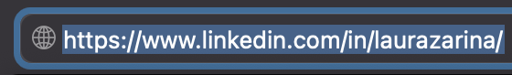
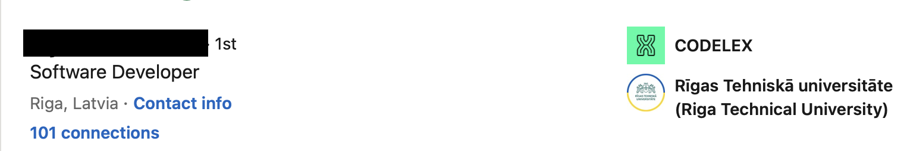
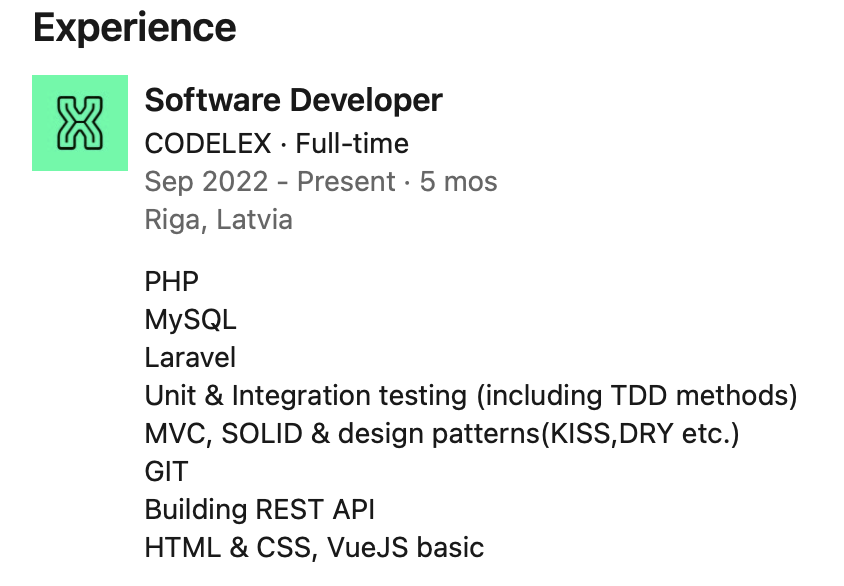
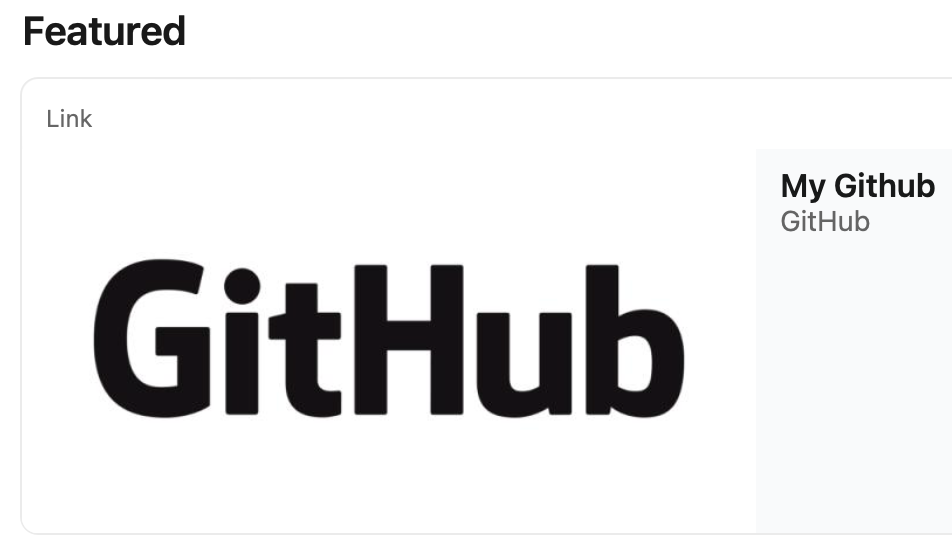
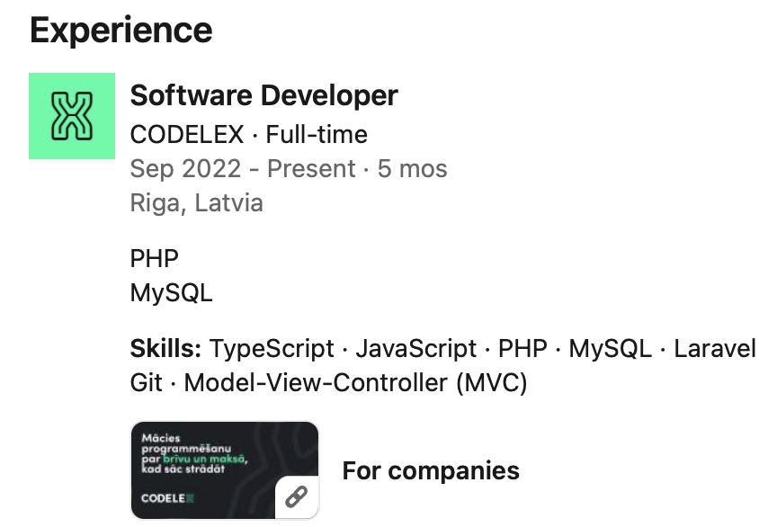
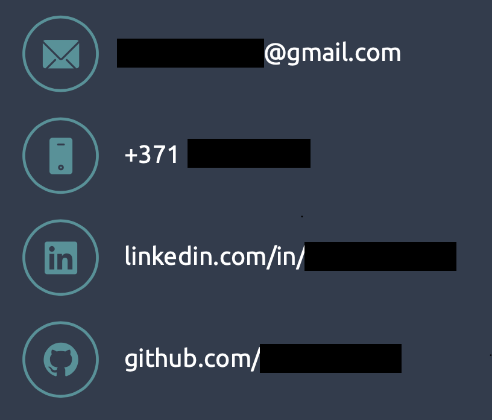

# CV & LinkedIn & ...

Tu esi iemācījies ārprātīgi daudz par programmēšanu - tagad ir laiks parādīt sevi darba devējiem, kāpēc vajadzētu nolīgt tieši tevi. Ņemsim nelielu pauzi no programmēšanas un sagatavosim tevi darba meklējumiem.

Iespējams, tu domā, ka visu izšķir programmēšanas prasmes un labs pieteikums nav vajadzīgs, bet tādā gadījumā tu kļūdies.

**Labs LinkedIn profils / CV var būt noteicošais faktors meklējot darbu, tāpēc pievērs uzmanību katram šeit atrodamajam punktam.**

**NETĒRĒ CITU LAIKU** - pirms atrādi savu CV, Linkedin un GitHub kādam no Codelex pārstāvjiem, pārliecinies, ka ir izpildīti VISI šeit uzskaitītie punkti. Ja to ir grūti izdarīt, velc tiem līdzi ar pirkstu.

## ⬇️ Github

Github ir iespēja izveidot sava profila README, vairāk informācijas:

- [setting up and managing your github profile @docs.github](https://docs.github.com/en/free-pro-team@latest/github/setting-up-and-managing-your-github-profile/managing-your-profile-readme)
- [awesome github profile readme @github](https://github.com/abhisheknaiidu/awesome-github-profile-readme)
- [how to create a kickass github profile page @github](https://catalins.tech/how-to-create-a-kickass-github-profile-page)
- [creative profile readme @github](https://github.com/coderjojo/creative-profile-readme)

Izveido README failu, pievieno aprakstu par sevi, linku uz LinkedIn profilu un savus trīs labākos projektus ar nelielu aprakstu par katru no tiem. Kamēr esi darba meklējumos (un arī pēc tā) ir vēlāms regulāri atjaunot savu profilu.

## ⬇️ LinkedIn

Pievieno kvalitatīvu fotogrāfiju

Izveido korektu url profilam

Visu raksti pareizā angļu valodā

Tagline norādi:

- Software Developer
- Software Engineer
- PHP Developer
- Full-Stack Developer
- vari arī būt radošs un rakstīt, piemēram, Passionate Software Developer vai ko līdzīgu

Tev ir nepieciešami vismaz 100 connections (to var izdarīt aicinot visus no codelex)

Programmēšanas prasmēm un Codelex ir jābūt redzamākajā vietā

About sadaļā NEraksti, ka pašlaik mācies un gribi būt programmētājs. Jābūt pārliecinošam tekstam, ka esi programmētājs ar teicamām prasmēm, piemēram, PHP, MySQL, Laravel, GIT, HTML, CSS, JavaScript utt. Papildus apraksti, kāpēc izvēlējies kļūt par programmētāju. Šeit vari minēt arī savus hobijus, soft skills un citas prasmes.

Codelex norādi kā Experience nevis Education vai Courses un pievieno visas prasmes, kuras apguvi

Pievieno linku uz savu GitHub profilu redzamā vietā

Pie Codelex Experience apraksti, kādus projektus esi sagatavojis

Norādi linku uz uzņēmumu sadaļu Codelex mājaslapā - https://www.codelex.io/en/partners

Sertifikāti - pievieno vismaz vienu tiešsaistes programmēšanas kursu, kuru tu nesen esi pabeidzis. Piemēram, Udemy, Codecademy, CodinGame u.c. vai jautā savam pasniedzējam.

Pievieno arī nepabeigtu augstāko izglītību, ja esi mācījies ilgāk par gadu

Norādi savu e-pastu un tel., lai nepieciešamības gadījumā ar tevi var sazināties

❌ Neraksti un nekur neiekļauj vārdu `Junior` (arī pēc darba piedāvājuma saņemšanas)!

❌ Nerakstīt `Open for Opportunities` un nelikt to zaļo rāmi _#OpenForWork_ (jo programmētāji darbu nemeklē un tas var kaitēt).

❌ Tagline nenorādīt Software Developer at CODELEX

❌ Nepievieno mazkvalificētus darbus, piemēram, McDonalds, Rimi/Maxima, celtniecība u.c.

## ⬇️ CV

Izmanto skaistu, viegli lasāmu template https://www.canva.com, https://flowcv.com u.c.

Centies CV sagatavot uz 1 lapas, vidēji HR katram CV velta tikai 6 sekundes

Pievieno kvalitatīvu fotogrāfiju

Visu raksti pareizā angļu valodā

Programmēšanas prasmēm un Codelex ir jābūt redzamākajā vietā

Kontaktu sadaļā norādi: e-pasts, tel., linkedin links, github links

About sadaļā NEraksti, ka pašlaik mācies un gribi būt programmētājs. Jābūt pārliecinošam tekstam, ka esi programmētājs ar teicamām prasmēm, piemēram, PHP, MySQL, Laravel, GIT, HTML, CSS, JavaScript utt. Papildus apraksti, kāpēc izvēlējies kļūt par programmētāju.

Work History sadaļu labāk sauc par Work Experience

Codelex norādi kā Experience nevis Education vai Courses

Pie Codelex Experience apraksti, kādus projektus esi sagatavojis

Centies izvairīties no gariem teikumiem, labāk izmanto bullet points

Iekļauj references. Pasniedzēja vārds, uzvārds un telefona numurs un Codelex vadītājs - Sandris Artemjevs, +371 29797471

Norādi linku uz uzņēmumu sadaļu Codelex mājaslapā - https://www.codelex.io/en/partners

Sadaļa Technical Skills. Norādi savus Software Development skills, kā arī citus, kas varētu būt noderīgi jaunajā darbā, piemēram, projektu vadība, dizains, testēšana u.c. (zemāk ir norādītas prasmes)

Sadaļa Soft Skills

Sertifikāti - pievieno vismaz vienu tiešsaistes programmēšanas kursu, kuru tu nesen esi pabeidzis. Piemēram, Udemy, Codecademy, CodinGame u.c. (vai arī jautā savam pasniedzējam ko iekļaut)

Pievieno arī nepabeigtu augstāko izglītību, ja esi mācījies ilgāk par gadu (neuzsvērt, ka nepabeigta)

Intereses / Hobiji - vēlams minēt arī kaut ko saistībā ar datoriem

CV saglabā PDF formātā ar nosaukumu CV_Vards_Uzvards.pdf

❌ Nevajag izmantot [Europass]()!

❌ Nepievieno mazkvalificētus darbus, piemēram, McDonalds, Rimi/Maxima, celtniecība u.c.

Vari palasīt arī par citiem ieteikumiem CV izveidē [šeit @weresumes.com](http://www.weresumes.com/uncategorized/resume-tips-recruiters-read-resume/)

## ⬇️ Prasmes

### C# / .NET programmētāji

- Git
- C#
- .NET
- Relational Databases & SQL
- HTTP & Web API Basics
- Unit Testing
- Test Driven Development
- Clean Code, SOLID
- Design Patterns
- HTML & CSS, VueJS, TypeScript & NodeJS basics

### Frontend programmētāji

- Git
- React
- JavaScript & TypeScript
- TDD
- HTTP
- HTML & CSS
- Clean Code
- NodeJS basics

### PHP programmētāji

- PHP
- MySQL
- Laravel
- Unit & Integration testing (including TDD methods)
- MVC, SOLID & design patterns (KISS, DRY etc.)
- GIT
- Building REST API
- HTML & CSS, VueJS basics

### Java programmētāji

- GIT
- OOP Java & Spring
- Unit testing
- JPA
- SQL
- Frontend basics with Angular
